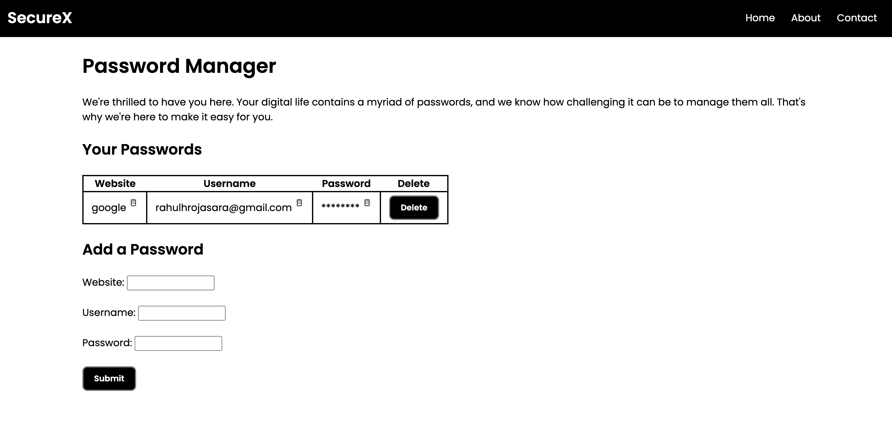

# securex-password-manager
**SecureX** is a simple offline password manager built with HTML, CSS &amp; JavaScript. Save, view, copy, and delete your passwords locally in the browser with a clean, easy UI.

# SecureX  
Modern Password Manager built with HTML, CSS & JavaScript  
Designed and developed by @codingwithrahul

## Features
- Save website, username & password
- Masked password display
- Copy to clipboard
- Delete entries
- Sticky navbar with Home, About & Contact

## Tech Used
- HTML
- CSS
- JavaScript

## Live Demo
https://your-github.github.io/securex-password-manager/

## File Structure
index.html
about.html
contact.html
style.css
script.js
copy.svg

## Screenshot

